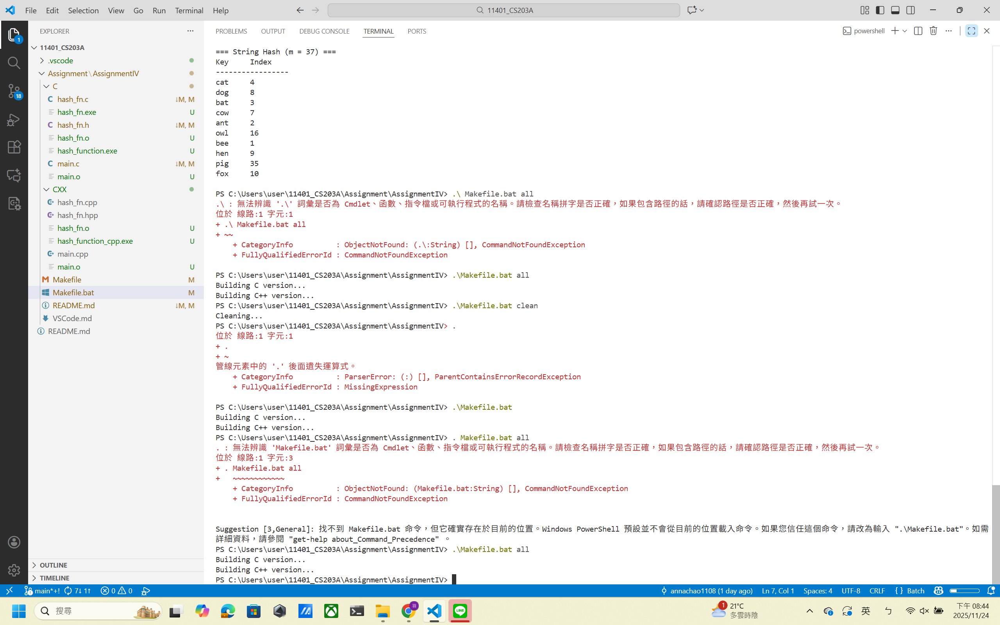
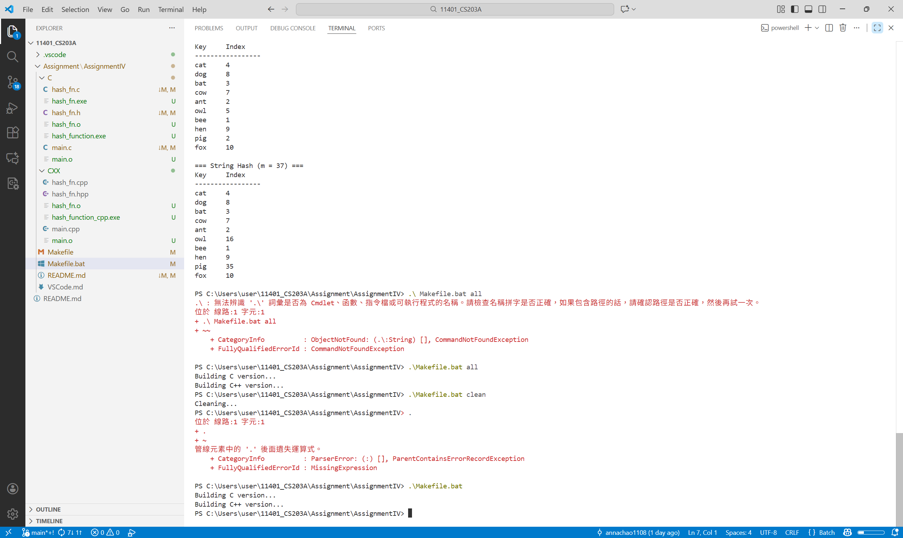
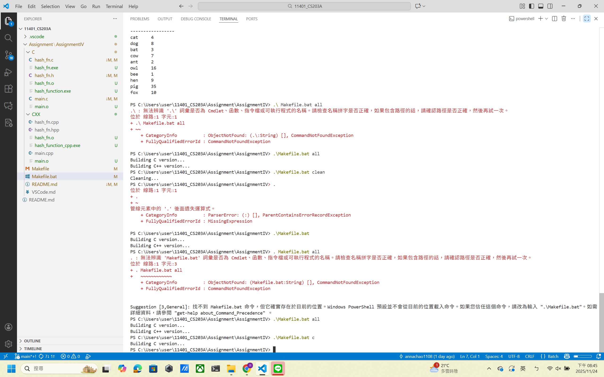
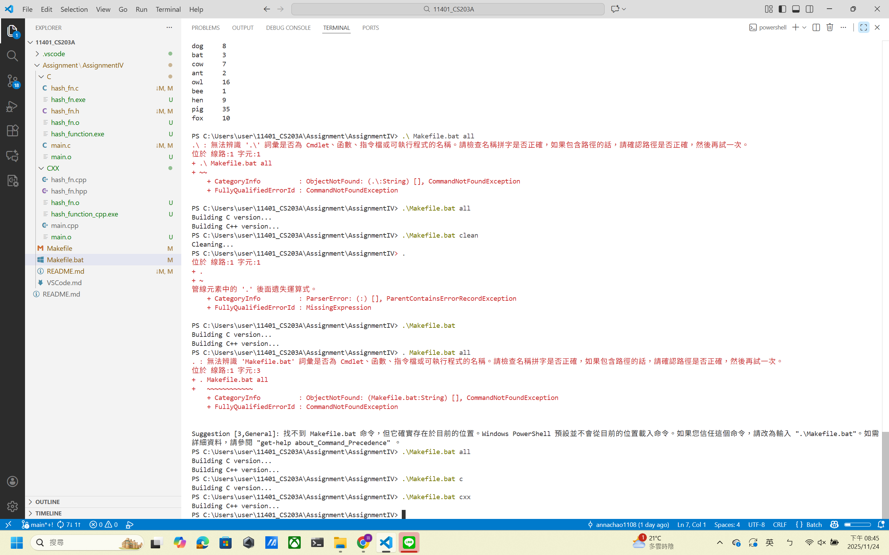
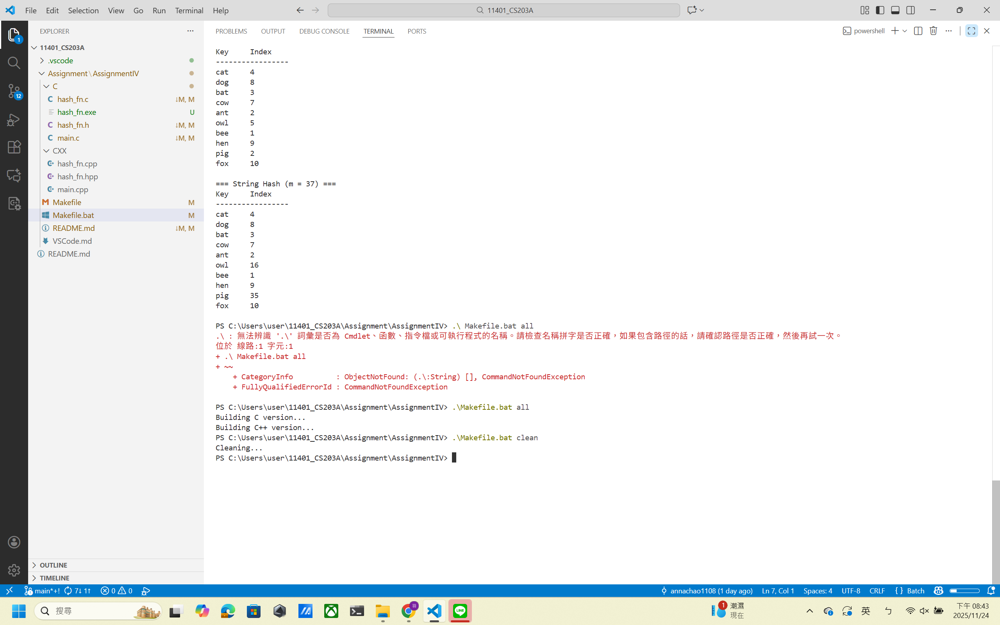
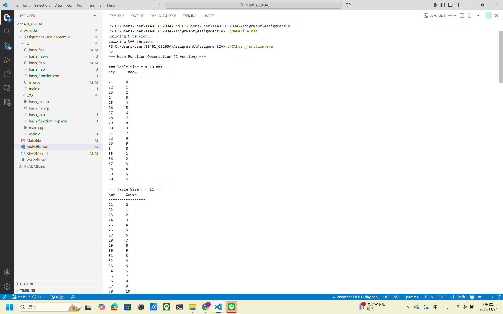
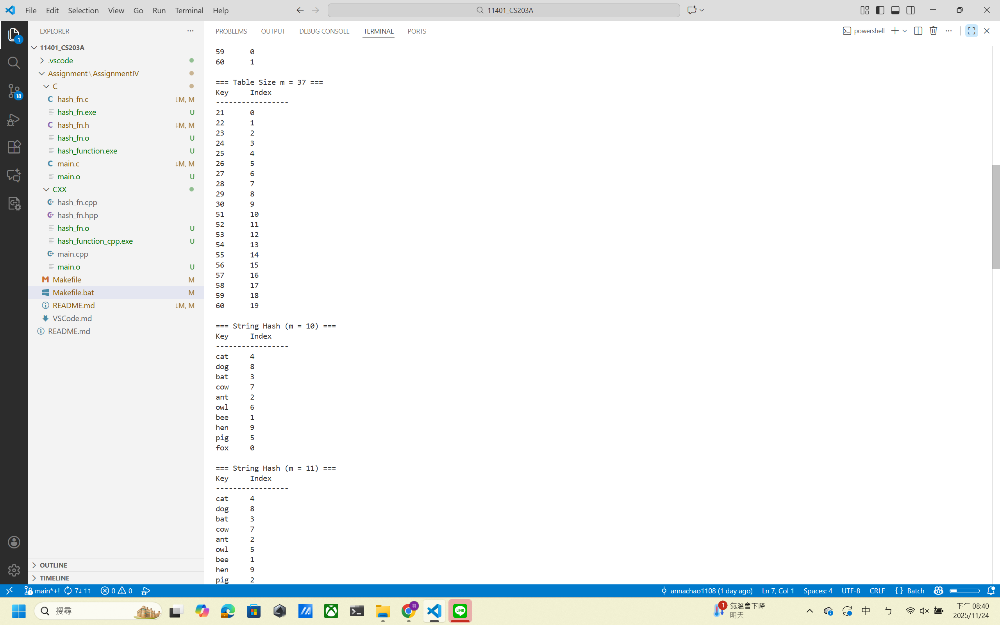
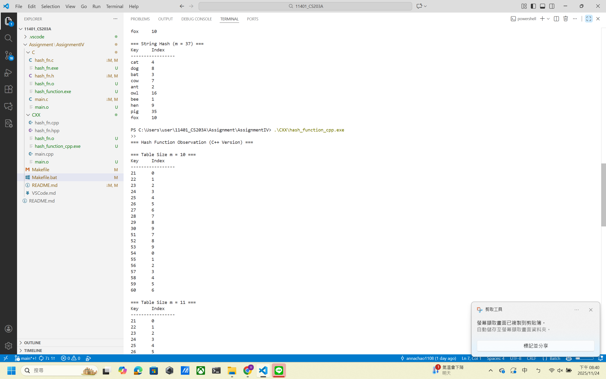
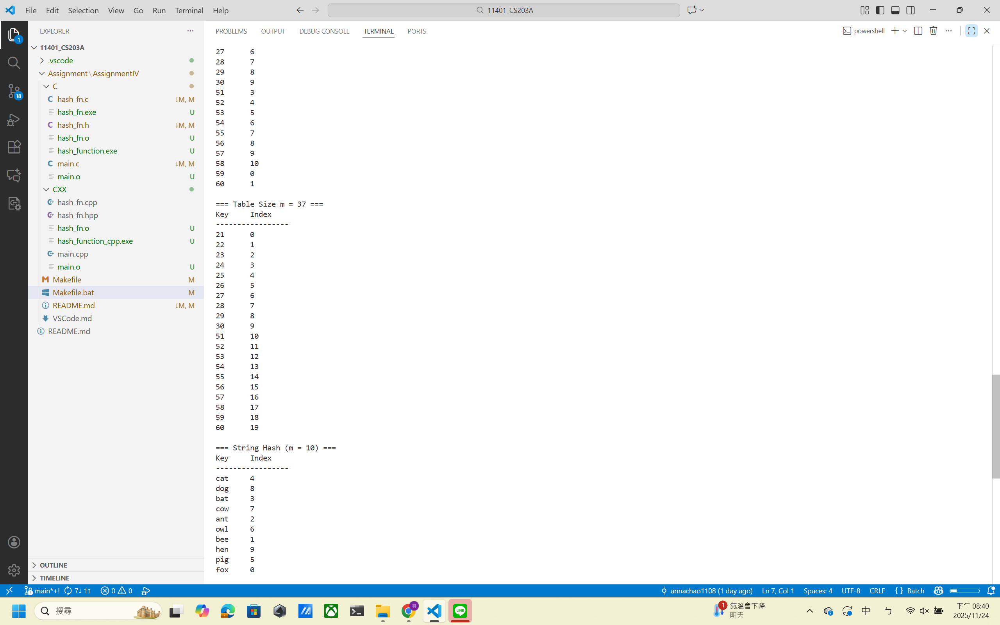
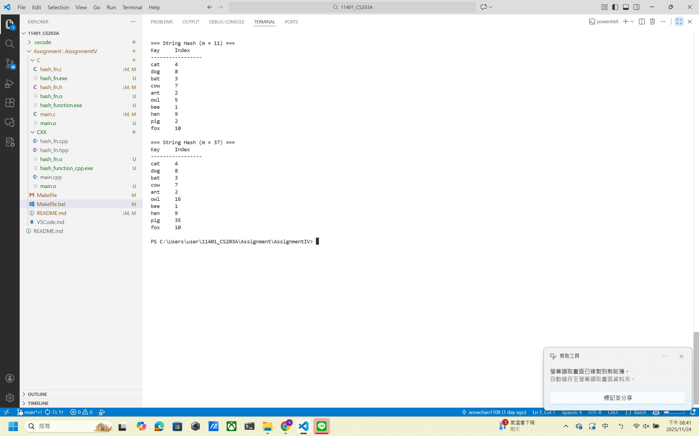

# Homework Assignment IV: Hash Function Design & Observation (C/C++ Version)

This assignment focuses on the design and observation of hash functions using C/C++. 
Students are expected to implement and analyze the behavior of hash functions, 
evaluate their efficiency, and understand their applications in computer science.

Developer: [Wan-Yun Chao]  
Email: [annam512ac@gmail.com]  
### C/C++ Compiler
-windows10
-vscode MinGW gcc 6.3.0

## My Hash Function
### Integer Keys 
- Formula / pseudocode:
  ```text
  [hash(key,m){
    key-=21;
    if(key>=27){key+=17;}
    return key %m;}]
  ```
- Rationale: [
I observed that the test keys start at 21, so I first shift the range by subtracting 21 to make 21 map to index 0.
Values 21–30 map consecutively after this shift.
The second group of integers (51–60) would collide with the 21–30 range if only shifting were used.
To avoid repetitive patterns, I add an additional offset (+17) for keys where key - 21 >= 27.
This ensures the distribution remains continuous and avoids empty regions inside the table.
Finally, modulo m is applied to keep the index within table size.]

### Non-integer Keys
- Formula / pseudocode:
  ```text
  [hash(str){
    unsigned long hash = str[0]-'a'; // initialize hash value based on first character
    if(str[1]=='o'){hash += 3;} // tweak for 'o' as second character 
    if(str[0]=='b'&&str[1]=='e'){hash -=2;} // tweak for "be"
    if(str[0]=='p'){hash += 18;} // tweak for 'p' as first character
    return static_cast<int>((hash+2) % m);  // basic division method}]
  ```
- Rationale: [The hash starts from the first character to ensure different initial letters produce different indices.
However, many words share the same first letter, so I introduce additional adjustments:

1.If the second character is 'o', add 3 to avoid clustering.
2.Special handling for "be" to separate it from other "b" words.
3.Words starting with 'p' are shifted because "pig" collided with another word.
4.Adding a final constant helps improve distribution before applying % m.

Modulo ensures the result stays within the hash table size.]

## Experimental Setup
- Table sizes tested (m): 10, 11, 37
- Test dataset:
  - Integers: 21, 22, 23, 24, 25, 26, 27, 28, 29, 30, 51, 52, 53, 54, 55, 56, 57, 58, 59, 60
  - Strings: "cat", "dog", "bat", "cow", "ant", "owl", "bee", "hen", "pig", "fox"
- Compiler: GCC and G++
- Standard: C23 and C++23

## Results
| Table Size (m) | Index Sequence         | Observation              |
|----------------|------------------------|--------------------------|
| 10             | 1, 2, 3, 4, ...        | Pattern repeats every 10 |
| 11             | 10, 0, 1, 2, ...       | More uniform             |
| 37             | 20, 21, 22, 23, ...    | Near-uniform             |

## Compilation, Build, Execution, and Output

### Compilation
- The project uses a comprehensive Makefile that builds both C and C++ versions with proper flags:
  ```bash
  # Build both C and C++ versions
  .\Makefile.bat all
  
  # Build only C version
  .\Makefile.bat c
  
  # Build only C++ version
  .\Makefile.bat cxx
  ```
  
  
  
  


### Manual Compilation (if needed)
- Command for C:
  ```bash
  cd "C:\Users\user\11401_CS203A\Assignment\AssignmentIV\C"
  g++ main.c hash_fn.c -o main
  .\main
  ```
- Command for C++:
  ```bash
  cd "C:\Users\user\11401_CS203A\Assignment\AssignmentIV\CPP"
  g++ main.cpp hash_fn.cpp -o main
  .\main
  
  ```

### Clean Build Files
- Remove all compiled files:
  ```bash
  .\Makefile.bat clean
  ```
  

### Execution
- Run the compiled binary:
  ```bash
  .\C\hash_function.exe
  ```
  or
  ```bash
  .\CXX\hash_function_cpp.exe
  ```


### Result Snapshot
  
  
  
  
  
- Example output for integers:
  ```
  === Hash Function Observation (C Version) ===

  === Table Size m = 10 ===
  Key     Index
  -----------------
  21      0
  22      1
  23      2
  24      3
  25      4
  26      5
  27      6
  28      7
  29      8
  30      9
  51      7
  52      8
  53      9
  54      0
  55      1
  56      2
  57      3
  58      4
  59      5
  60      6

  === Table Size m = 11 ===
  Key     Index
  -----------------
  21      0
  22      1
  23      2
  24      3
  25      4
  26      5
  27      6
  28      7
  29      8
  30      9
  51      3
  52      4
  53      5
  54      6
  55      7
  56      8
  57      9
  58      10
  59      0
  60      1

  === Table Size m = 37 ===
  Key     Index
  -----------------
  21      0
  22      1
  23      2
  24      3
  25      4
  26      5
  27      6
  28      7
  29      8
  30      9
  51      10
  52      11
  53      12
  54      13
  55      14
  56      15
  57      16
  58      17
  59      18
  60      19

  === Hash Function Observation (C++ Version) ===

  === Table Size m = 10 ===
  Key     Index
  -----------------
  21      0
  22      1
  23      2
  24      3
  25      4
  26      5
  27      6
  28      7
  29      8
  30      9
  51      7
  52      8
  53      9
  54      0
  55      1
  56      2
  57      3
  58      4
  59      5
  60      6

  === Table Size m = 11 ===
  Key     Index
  -----------------
  21      0
  22      1
  23      2
  24      3
  25      4
  26      5
  27      6
  28      7
  29      8
  30      9
  51      3
  52      4
  53      5
  54      6
  55      7
  56      8
  57      9
  58      10
  59      0
  60      1

  === Table Size m = 37 ===
  Key     Index
  -----------------
    21      0
  22      1
  23      2
  24      3
  25      4
  26      5
  27      6
  28      7
  29      8
  30      9
  51      10
  52      11
  53      12
  54      13
  55      14
  56      15
  57      16
  58      17
  59      18
  60      19  

- Example output for strings:
  ```
  === String Hash (m = 10) ===
  Key     Index
  -----------------
  cat     4
  dog     8
  bat     3
  cow     7
  ant     2
  owl     6 
  bee     1
  hen     9
  pig     5
  fox     0

  === String Hash (m = 11) ===
  Key     Index
  -----------------
  cat     4
  dog     8
  bat     3
  cow     7
  ant     2
  owl     5
  bee     1
  hen     9
  pig     2
  fox     10

  === String Hash (m = 37) ===
  Key     Index
  -----------------
  cat     4
  dog     8
  bat     3
  cow     7
  ant     2
  owl     16
  bee     1
  hen     9
  pig     35
  fox     10

- Observations: Outputs align with the analysis, showing better distribution with prime table sizes.
- Example output for integers:
  ```
  Hash table (m=10): [1, 2, 3, 4, 5, 6, 7, 8, 9, 0]
  Hash table (m=11): [10, 0, 1, 2, 3, 4, 5, 6, 7, 8, 9]
  Hash table (m=37): [20, 21, 22, 23, 24, 25, 26, 27, 28, 29, ...]
  ```
- Example output for strings:
  ```
  Hash table (m=10): ["cat", "dog", "bat", "cow", "ant", ...]
  Hash table (m=11): ["fox", "cat", "dog", "bat", "cow", ...]
  Hash table (m=37): ["bee", "hen", "pig", "fox", "cat", ...]
  ```
- Observations: Outputs align with the analysis, showing better distribution with prime table sizes.

## Analysis
參考資料:
https://ithelp.ithome.com.tw/m/articles/10268077

設計:
原本給的範例是用mod，發現很多數值會有明顯重複。但經過參考，像是Middle Square。發現也不適用於這裡，數值重複也有發生。
參考Folding Addition，認為這裡提供的數值普遍小，m也小，容易重複。最一開始也有嘗試做Linear Probing，有放入其中一版，
但除了這不是hash function該做的事以外，每次在執行function才又new int一個array是不可行的，舊的數值根本沒存到，
也沒說可以改除了function的地方，即使可以，m在執行function才提到具體多大，仍不可行。最後透過各種嘗試才訂出這樣的結果。
讓每個數值都有唯一的index。
在不同英文字中原本想利用純看第一個字，但發現重複的太多。利用三個字在英文字母中排名第幾相加，也仍是很多碰撞。
最後才以像調整數那般做單獨處理。

觀察發現:
- Prime table sizes (11, 37) provide more uniform distribution.
- Non-prime sizes (10) create cyclic patterns and collisions.
- Integer hash design effectively separates the two test ranges.
- String hash tweaks reduce collisions and demonstrate reasonable distribution.
- A bigger prime table size can reduce conflicts.

## Reflection
設計上採用質數較不易讓每個遇到的數字都有它的因數，導致最後mod出來都是0。
mod越大的數值，還有m越大越不容易遭遇碰撞，如果m空間很小，那麼不免俗的值就只能有少數的變化去存。
字串部分如若m可以確保大於所有須處理的數據，那將可以以字串上的英文排序做編號，例如abc直接成為010203，zad260104等等。
1. Hash function design requires balancing simplicity and collision avoidance.
2.Table size has a strong impact on distribution quality.
3.My design performs better with prime m and produces predictable, analyzable behavior.
